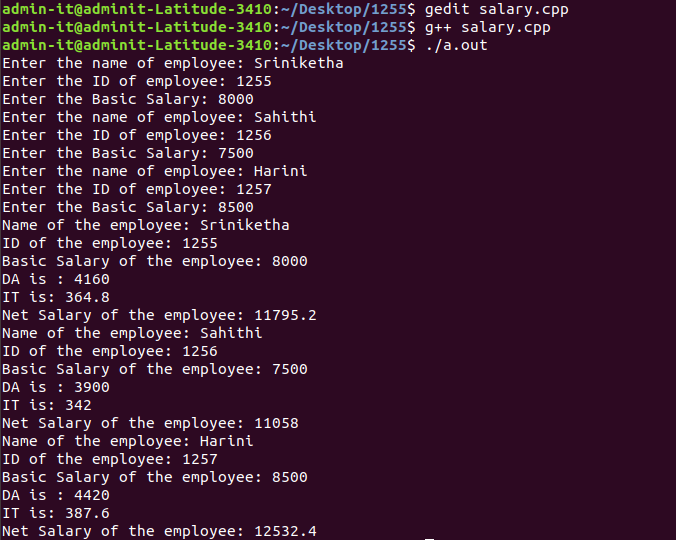

# Experiment 3
## Write a C++ program to read the data of N employee and compute Net salary of each employee (DA=52% of Basic and Income Tax (IT) =30% of the gross salary).
### Step-by-step procedure for the experiment
### Output Obtained

