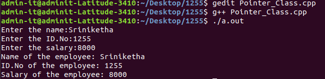

# Experiment 5
## Write a C++ program to declare a class. Declare pointer to class. Initialize and display the contents of the class member.

### Step-by-step procedure for the experiment

### Output Obtained

