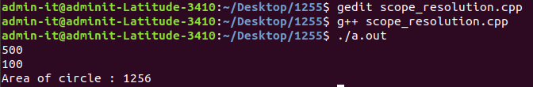

# Experiment 6
## Write a C++ program to use scope resolution operator. Display the various values of the same variables declared at different scope levels.

### Step-by-step procedure for the experiment

### Output Obtained

